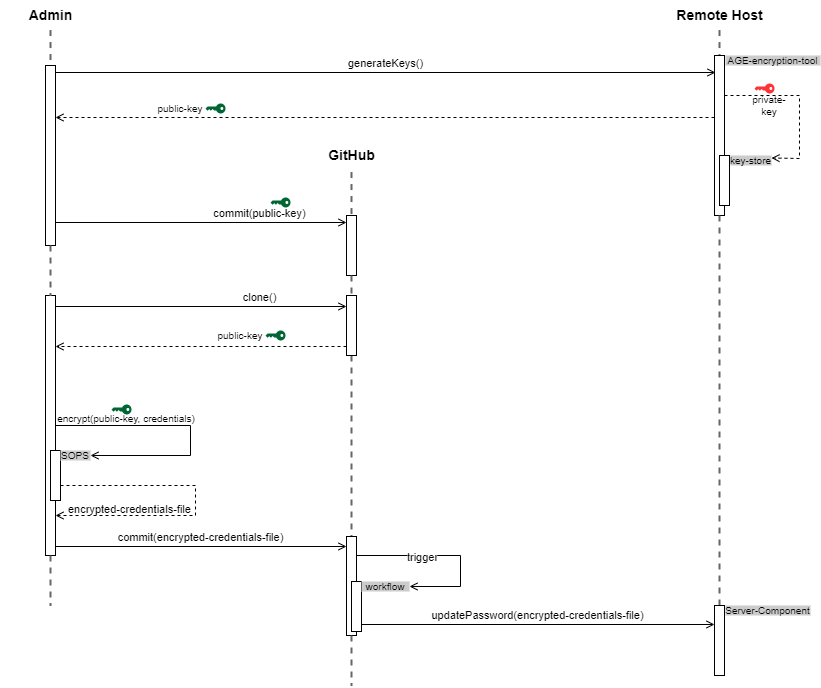

# sopsage
Project to demonstrate an approach for managing security with SOPS, AGE, Docker and GitHub

### Approach





#### 1. Setup and installation
The folder setup-sops-and-age contains a docker-compose project which will create an image and then start a container called sopsage with all the tools installed and setup.
To stop and clean up run
```
docker compose down
docker compose rm -f
```
To re-build the image and start the container `docker compose build --no-cache --pull`

The private key will need to be securely stored on the server and the environment variable
SOPS_AGE_KEY_FILE=/path/to/age-key.private

To set the environment variable automatically 
login with the id that will need to use the environment variable then
edit ~/.profile and add the following two lines at the end
```
SOPS_AGE_KEY_FILE=/mnt/dev-volume-1/.secrets/sopsage/age-key.private
export SOPS_AGE_KEY_FILE
```

reload the profile after the changes wit `. ~/.profile` or the equivalent `source ~/.profile`
