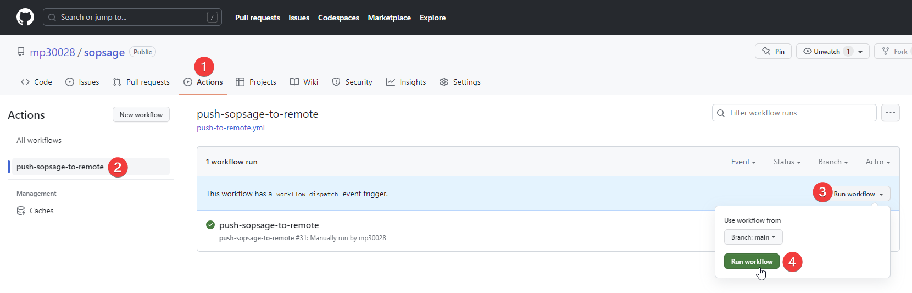
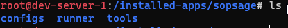

# sopsage
Project to demonstrate an approach for managing security with SOPS, AGE, Docker and GitHub


## Approach


## 1. Setup and installation


### 1.1 - Push setup artifacts to server<br/>
This can be easily done with the push-sopsage-to-remote workflow. The workflow has to be triggered manually and uses the configs in GitHub:Actions:Secrets-and-variables to push to a remote host.<br/>

To setup manually the easiest way is to clone the [sopsage-repo](https://github.com/mp30028/sopsage)<br/>
<br/>

### 1.2 - Prepare storage of private key
```
sudo mkdir -p /path/to/keys/folder`
sudo groupadd sopsage-key-readers
sudo getent group | grep sopsage
sudo usermod -a -G sopsage-key-readers gitwfuser
sudo chmod -R o-rwx /mnt/dev-volume-1/.secrets/
sudo chown -R root:sopsage-key-readers path/to/top/level/parent/of/keys/folder
echo 'export SOPS_AGE_KEY_FILE=path/to/keys/folder/age-key.private' >> ~/.bashrc
source ~/.profile
echo $SOPS_AGE_KEY_FILE
```

### 1.3 - Key files and folders<br/>
The workflow should have created three key folders as illustrated below<br/>

<br/><br/>

```
sopsage
├── configs
│   ├──
│   ├──
│   ├──
│   └──
├── runner
│   ├── docker-compose.yml
│   ├── Dockerfile
│   └── scripts
│       └── encrypt-configs.sh
└── tools
    ├── decrypt-configs.sh
    ├── encrypt-configs.sh
    └── generate-keys.sh
```

## 2 - Start the runner container
The `runner` folder holds a docker compose project and is the core on top of which the tools run.<br/>

Build and run runner-compose-project first time with 
```
cd path/to/sopsage/runner
docker compose build --no-cache --pull
docker compose up -d
```

To stop the containers run `docker compose down` <br/>

Once the image has been built the containers can be started with `docker compose up -d`

## 3. Generate encryption keys
`cd path/to/tools/folder`
`sh ./generate-keys.sh "$SOPS_AGE_KEY_FILE" path/to/age-key.public`<br/>

The private key will need to be securely stored on the server and the environment variable
SOPS_AGE_KEY_FILE=/path/to/age-key.private has to be set and was done when preparing the storage
of the private keys. If however the full path to the private key is provided instead of the environment
variable then it will be automatically be added.<br/>

The profile needs to be reloaded after the changes wit `. ~/.profile` or the equivalent `source ~/.profile`

## 4. Encrypt sensitive values in configs
`cd path/to/tools/folder`
`sh ./encrypt-configs.sh /path/to/config/file/to/be/encrypted /path/to/age-key.public` "key_name_1|key_name_2|....|key_name_n}"
`rm /path/to/config/file/to/be/encrypted`

## 5. Decrypt encrypted sensitive values
`cd path/to/tools/folder`
`sh ./decrypt-configs.sh /path/to/config/file/to/be/decrypted`