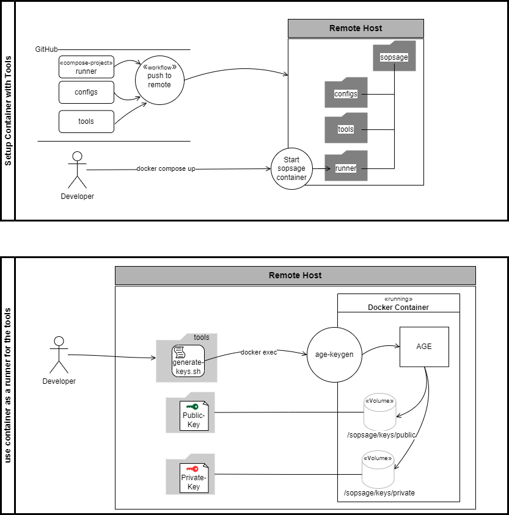
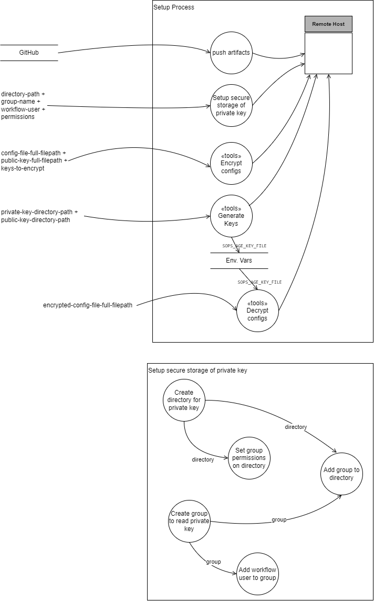

# sopsage
Project to demonstrate an approach for managing security with SOPS, AGE, Docker and GitHub


### Approach





## 1. Setup and installation


### 1.1 - Push setup artifacts to server<br/>
This can be easily done with the push-to-remote workflow. The workflow has to be triggered manually and uses the configs in GitHub:Actions:Secrets-and-variables to push to a remote host.<br/>
To setup manually the easiest way is to clone the [sopsage-repo](https://github.com/mp30028/sopsage)<br/>
<br/>

### 1.2 - Key files and folders<br/>
There are three key folders as illustrated below.<br/>
```
sopsage
├── configs
│   ├──
│   ├──
│   ├──
│   └──
├── runner
│   ├── docker-compose.yml
│   ├── Dockerfile
│   └── scripts
│       └── encrypt-configs.sh
└── tools
    ├── decrypt-configs.sh
    ├── encrypt-configs.sh
    └── generate-keys.sh
```

### 1.3 - Start the runner container<br/>
The `runner` folder holds a docker compose project and is the core on top of which the tools run.<br/>

Build and run runner-compose-project first time with 
```
cd path/to/sopsage/runner
docker compose build --no-cache --pull
docker compose up -d
```

To stop the containers run `docker compose down` <br/>

Once the image has been built the containers can be started with `docker compose up -d`

## 2. Generate encryption keys
```
The private key will need to be securely stored on the server and the environment variable
SOPS_AGE_KEY_FILE=/path/to/age-key.private

To set the environment variable automatically 
login with the id that will need to use the environment variable then
edit ~/.profile and add the following two lines at the end
```
SOPS_AGE_KEY_FILE=/mnt/dev-volume-1/.secrets/sopsage/age-key.private
export SOPS_AGE_KEY_FILE


reload the profile after the changes wit `. ~/.profile` or the equivalent `source ~/.profile`

## 3. Encrypt sensitive values in configs


## 4. decrypt encrypted sensitive values
